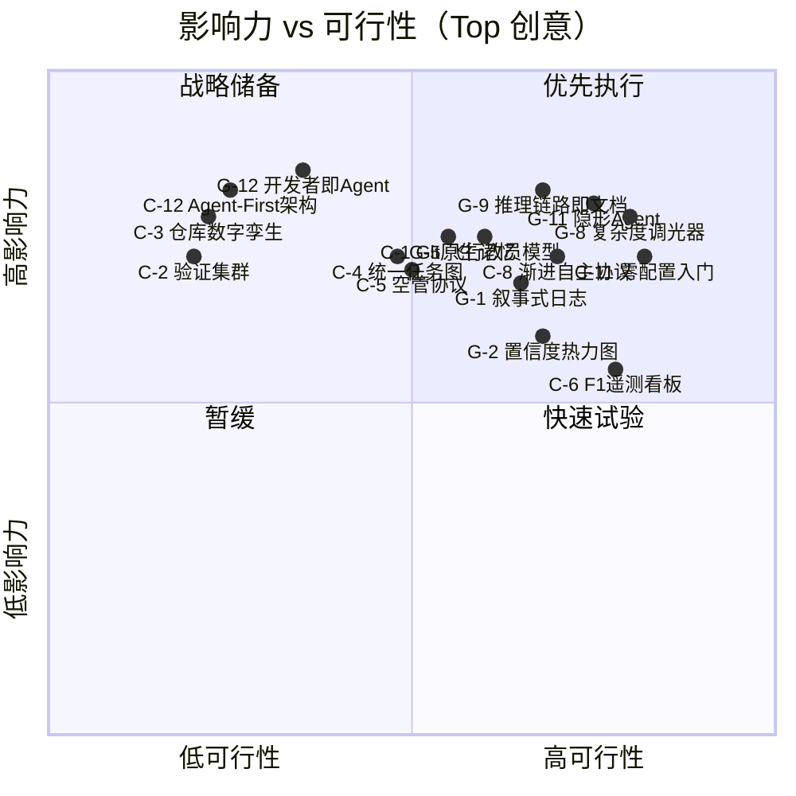
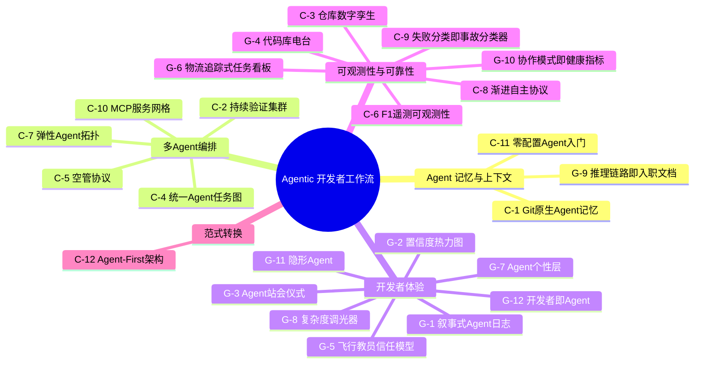

# 头脑风暴报告：Agentic 开发者工作流

## 摘要

Agentic 开发者工作流正处于拐点：工程师在约 60% 的工作中使用 AI，但仅有 0-20% 的任务被完全委托给 AI，这揭示了"辅助"与"自主"之间的巨大鸿沟。通过对 50+ 信息源、5 大行业趋势和 5 个真实案例的研究，我们产出了 24 个创新想法，并从影响力、可行性、创新性和对齐度四个维度进行了评估。首选方案是 **零配置 Agent 入门（Zero-Config Agent Onboarding）** — 消除每个开发者都会遇到的冷启动配置障碍 — 随后是一系列降低认知负荷、构建渐进信任的开发者体验改进方案。战略方向清晰：**先赢开发者体验，再建可观测性，最后推范式转换**。

---

## 1. 研究全景

### 1.1 市场背景

Agentic AI 市场预计在 2030 年达到 **$52.62B**（年复合增长率 46.3%）。Gartner 报告多 Agent 系统咨询量从 2024 Q1 到 2025 Q2 **暴涨 1,445%**。然而在这爆发式增长的背后是严峻的现实：只有不到 **25% 的组织**成功将 Agent 工作流推向生产。瓶颈不在能力 — 当前 Agent 在 5 万行以下的代码库上能自主完成 85% 的重构任务 — 而在于可靠性、信任和运维成熟度。

2026 年的核心矛盾：工程师持续与 AI 交互，但很少交出控制权。这个 **60% 使用率 vs 0-20% 委托率**的差距就是主要机会空间。缩小这一差距需要解决三个相互关联的问题：上下文管理（Agent 在会话间遗忘一切）、编排（多 Agent 协调容易出错）、信任校准（开发者要么过度限制，要么过度信任 Agent）。

### 1.2 关键趋势

1. **多 Agent 系统爆发**：GitHub Agent HQ 支持 Claude、Codex、Copilot 同时处理同一任务。多视角代码生成正在成为常态。
2. **仓库智能（Repository Intelligence）**：AI 从理解代码行进化到理解整个代码库的关系和架构意图 — Anthropic 2026 报告将此定义为核心能力跃迁。
3. **并行 Agent 工作流**：开发者从监督单个同步助手，转向管理多个自主并行工作的 Agent。
4. **MCP 成为标准协议**：Model Context Protocol 已成为 Agent-工具交互的公认接口，推动了集中管理和自动发现的需求。
5. **开发者角色转型**：软件工程的价值正从写代码转向系统架构设计、护栏定义和输出验证。

### 1.3 竞争格局

- **Agent IDE 层**：Cursor、Windsurf、Claude Code 在开发者界面层竞争，各自采用不同的 Agent 集成深度。
- **编排平台层**：GitHub Agent HQ、LangChain/LangGraph、CrewAI 瞄准多 Agent 协调，但尚未形成主导标准。
- **垂直解决方案**：安全审查、性能优化、测试生成等领域专用工具正作为插件能力涌现。

典型案例：Claude Code 在生产环境中实现 85% 自主重构完成率；Thomas Ricouard 使用 Cursor Agent Mode 将 iOS 应用入门时间从数周缩短至数天；AWS 多 Agent 工作流将问题解决时间缩短 86%。规律一致：**Agent 工作流在边界明确的任务上表现优异，但在模糊的架构决策上仍有困难**。

---

## 2. 创新空间

### 2.1 创意生成过程

使用 **SCAMPER** 创意框架（替代、合并、适应、修改、挪用、消除、反转）从两个互补视角生成创意：

- **Codex 视角**（12 个）：技术架构和基础设施 — 如何构建系统
- **Gemini 视角**（12 个）：创意用户体验 — 开发者如何与系统交互

双镜头方法确保了工程深度和以人为中心的设计的全面覆盖，避免了"技术优雅但无人采用"的常见陷阱。

### 2.2 创意概览

| 来源                    | 数量   | 聚焦                       |
| ----------------------- | ------ | -------------------------- |
| Codex（技术/架构）      | 12     | 基础设施、协议、系统设计   |
| Gemini（创意/用户体验） | 12     | UX、沟通、信任、工作流感受 |
| **合计**                | **24** |                            |

SCAMPER 全部 7 个角度均有覆盖。

### 2.3 分类亮点

创意聚类为 5 个亲和组，每组揭示一个独立洞察：

1. **Agent 记忆与上下文**（3 个创意，最高平均分 3.85）：最可解的问题空间。解决方案影响大，因为问题普遍且定义明确 — 每个开发者都面临冷启动问题。
2. **多 Agent 编排**（5 个创意，最低平均分 3.04）：技术野心最大的类别，可行性拖了后腿。洞察：多 Agent 是炒作热点，但单 Agent 体验才是当下的价值所在。
3. **开发者体验**（8 个创意，Top 5 中占 3 席）：最大的聚类，在排名中代表性最强。当前差异化因素不是 Agent 能力，而是开发者与 Agent 的交互方式。
4. **可观测性与可靠性**（7 个创意）：从原型到生产的桥梁。没有可观测性，< 25% 的生产化率不会改善。
5. **范式转换**（1 个创意）：Agent-First 架构在智识上引人注目，但执行上为时过早。最适合作为北极星，而非近期项目。

---

## 3. 评估结果

### 3.1 方法论

每个创意在四个维度上评分，采用均衡权重以优化实际可交付性和有意义的创新之间的平衡：

| 维度   | 权重 | 聚焦                                    |
| ------ | ---- | --------------------------------------- |
| 影响力 | 35%  | 问题解决程度、受益范围、价值量级        |
| 可行性 | 35%  | 技术难度、资源需求、交付周期            |
| 创新性 | 20%  | 新颖性、差异化潜力                      |
| 对齐度 | 10%  | 与改进 Agentic 开发者工作流目标的契合度 |

综合得分公式：`影响力 × 0.35 + 可行性 × 0.35 + 创新性 × 0.20 + 对齐度 × 0.10`

### 3.2 评估矩阵

象限图清晰展示：5 个创意位于**优先执行**区（高影响力 + 高可行性），一组变革性创意在**战略储备**区（高影响力但可行性较低），基础设施型创意在**暂缓**区等待生态成熟。

### 3.3 思维导图

---

## 4. Top 5 方案 — 深度分析

### 4.1 #1：零配置 Agent 入门（C-11）— 得分：4.25

**解决的问题**：每个使用 Agent 工具的开发者都面临冷启动问题。配置 CLAUDE.md、cursor rules、.clinerules 等文件既繁琐又容易出错，构成采用障碍。研究显示上下文管理是 Agent 工作流的关键使能因素，但负担完全落在人类身上。

**工作原理**：Agent 在新仓库首次调用时运行全面的引导分析 — 读取 README 获取项目意图，检查 CI 配置获取质量门禁，分析 git 历史获取约定（提交消息风格、分支策略、PR 模板模式），从现有代码推断编码标准（缩进、命名、模块结构），映射依赖图。分析产出一份结构化 Agent 配置文件，捕获项目的隐式规则。生成的配置展示给开发者审查 — 用 2 分钟验证替代 2 小时编写 — 然后提交为规范配置。

系统将 git 历史视为一等信号：提交频率揭示哪些模块在活跃演进；回滚模式暴露脆弱区域，需要保守的 Agent 行为；PR 评审评论主题浮现出静态配置无法捕获的质量预期。

**实施路径**：

- 阶段 1（4 周）：约定推断引擎 — git 历史分析、CI 配置解析、编码标准检测
- 阶段 2（3 周）：交互式审查 UI — 开发者查看推断的约定，确认/纠正/覆盖
- 阶段 3（2 周）：持续学习 — Agent 行为纠正自动更新配置

**风险与缓解**：推断的约定可能对风格不一致的项目不准确。缓解：始终以提案形式呈现推断，包含置信度分数，让开发者知道哪些规则需要仔细审视。

**成功指标**：首次调用到高效使用的时间（目标：< 5 分钟）；配置准确率（目标：< 15% 覆盖率）；新项目采用率（目标：3 个月内 80% 的新仓库使用自动生成配置）。

### 4.2 #2：隐形 Agent（G-11）— 得分：3.90

**解决的问题**：开发者每天因数十个琐碎审批而产生决策疲劳 — 格式化修复、依赖版本更新、模板代码生成等打断心流的常规任务。每次打断损失 10-15 分钟的上下文恢复时间。当前 Agent 交互模型对每个任务一视同仁，无论是关键架构变更还是一行导入修复。

**工作原理**：任务复杂度分类器根据风险-影响矩阵评估每个 Agent 操作。低于可配置阈值的操作静默执行 — Agent 像自动格式化工具一样在保存时运行。变更出现在安静的"Agent 变更日志"侧边栏，开发者在空闲时查看，而非作为阻塞式审批弹窗。UX 原则：Agent 应该像垃圾回收一样隐形 — 只有出问题时才注意到。

分类系统从保守开始（格式化、导入排序、lint 修复），随着可靠性验证逐步扩大范围。每类静默操作都有独立的回滚机制。如果静默变更导致测试失败，系统自动回滚并将任务升级为交互模式。

**实施路径**：

- 阶段 1（3 周）：定义初始"常规"任务分类，实现格式化和 lint 的静默执行，构建变更日志侧边栏 UI
- 阶段 2（4 周）：添加依赖更新支持（带自动测试门禁），扩展到已知模式的模板代码生成
- 阶段 3（持续）：机器学习分类 — 追踪开发者总是直接批准的任务，逐步移入静默类别

**成功指标**：日常审批提示减少 60%；开发者心流时间增加 30%；6 个月内零静默变更引发的生产事故。

### 4.3 #3：推理链路即入职文档（G-9）— 得分：3.85

**解决的问题**：文档一写完就过时。新团队成员花数周在代码库中摸索，架构决策的"为什么"只存在于高级工程师的脑子里。Agent 推理链路 — Agent 修改代码时产生的逻辑链条 — 正好捕获了这个"为什么"，但目前每次会话后就被丢弃了。

**工作原理**：每次 Agent 修改代码时，其推理链路被捕获、结构化并关联到对应的提交。当 Agent 重构一个服务时，其推理（"这个服务被拆分是因为原来违反了单一职责原则；支付逻辑依赖外部网关超时，不应阻塞订单处理"）变成可导航的架构导览。新开发者不读过时的 wiki — 他们通过 Agent 的推理链条理解代码库为什么是这个样子。

系统通过质量过滤器筛选链路：置信度评分判定哪些链路值得作为文档，摘要层将冗长推理压缩为简洁的架构注释。链路按模块组织，与代码双向链接（点击函数看它为什么存在；点击推理链路看它产出了什么代码），与代码一同版本化。

**成功指标**：新开发者入职时间减少 40%；文档时效性（目标：80% 模块的推理链路不超过 30 天）。

### 4.4 #4：复杂度调光器（G-8）— 得分：3.80

**解决的问题**：Agent 输出详细程度是持续的摩擦源。太详细开发者跳过不看，太简略开发者不信任。不同场景确实需要不同级别的细节 — 审查关键基础设施变更需要完整推理链，常规依赖更新只需要摘要。

**工作原理**：一个连续滑块（1-10）控制 Agent 在任何交互中暴露的细节量。位置 1：一行摘要 + "发布"按钮。位置 5：摘要、关键决策、变更文件、测试结果。位置 10：完整推理链、考虑过的替代方案、每个决策的置信度、性能基准。物理调光器的隐喻让 AI 透明度这个抽象概念变得直观可感。

系统从开发者行为中学习 — 追踪哪种任务模式使用哪个调光级别并自动建议。基础设施变更默认 7；格式化修复默认 2。

**成功指标**：开发者对 Agent 沟通的满意度（目标：4.5/5）；"解释更多"/"太详细了"反馈循环减少 70%。

### 4.5 #5：渐进自主协议 L1-L5（C-8）— 得分：3.80

**解决的问题**：当前 Agent 的信任模型是二元的 — Agent 要么能、要么不能执行操作。这迫使开发者陷入双输选择：过度限制 Agent（损失效率）或过度信任 Agent（冒代码质量风险）。

**工作原理**：借鉴自动驾驶安全等级（L1-L5），Agent 在新项目上从 L1（仅建议）开始。随着可靠性验证 — 通过建议采纳率、生成代码的测试通过率、无回滚变更来衡量 — 逐步升级：L2（自动应用 + 审查）、L3（自动应用非关键路径）、L4（测试通过即自动合并）、L5（完全自主 + 回滚能力）。信任级别是细粒度的：按 Agent、按仓库、按代码区域。一个 Agent 在测试套件中可以是 L4，但在支付处理模块中是 L2。

延迟质量信号（7 天内的回滚、追溯到 Agent 生成代码的 bug）反馈到信任评分中，防止 Agent 以牺牲长期质量为代价来优化即时采纳率。

**成功指标**：Agent 生成代码的缺陷率（目标：6 个月内与人工编写代码持平）；L3+ 代码区域占比（目标：12 个月内达到 50%）。

---

## 5. 战略建议

### 5.1 短期速赢（0-3 个月）

1. **发布零配置 Agent 入门**（C-11）：最高分方案，价值路径最短。组件已独立存在 — 整合即可。消除最大的采用障碍。
2. **构建复杂度调光器**（G-8）：主要是 UX 变更，后端工作量小。立即改善每次 Agent 交互。作为 feature flag 发布并根据使用数据迭代。
3. **原型 F1 遥测看板**（C-6）："快速试验"象限的速赢项目。轻量级 Agent 可观测性看板为后续投资积累运维知识。

### 5.2 中期投入（3-12 个月）

1. **部署隐形 Agent**（G-11）：需要从第一阶段学习到的复杂度分类器。从格式化和 lint 开始，逐类别扩展。
2. **实施渐进自主协议**（C-8）：依赖 F1 遥测原型的可观测性数据。需要 3 个月以上的可靠性数据才能让信任评分有意义。
3. **启动推理链路即文档**（G-9）：需要链路捕获基础设施和质量过滤。最好在 Agent 已在生产中活跃使用后启动。

### 5.3 长期押注（12+ 个月）

1. **Git 原生 Agent 记忆**（C-1）：零配置入门证明自动化上下文的价值后，进化为跨会话积累的持久化版本控制记忆。
2. **统一 Agent 任务图**（C-4）：多 Agent 使用成熟后，横跨人类和 Agent 工作的单一编排 DAG 需求将变得迫切。
3. **Agent-First 架构**（C-12）：北极星。每项短期和中期投入都应对照这个问题评估："这是否让我们更接近 Agent 作为主要执行者的世界？"

---

## 6. 风险与盲区

**未覆盖领域**：

- **定价与单位经济学**：每任务 Agent 算力成本、按人/按 token 定价模型、企业买家 ROI 框架均未探索。
- **安全与合规**：受监管行业（金融、医疗）要求 Agent 生成代码的审计追踪。自主代码生成的合规框架尚在萌芽期。
- **团队动态**：Agent 工作流如何影响初级开发者的技能发展。如果 Agent 处理常规编码，初级开发者如何学习？这个教学鸿沟可能造成长期人才梯队问题。

**可能出错的方向**：

- **信任侵蚀事件**：一个 Agent 引入安全漏洞的高曝光事故可能使采用倒退数年。渐进自主协议（C-8）部分对冲了这一风险，但行业信任是脆弱的。
- **模型能力平台期**：所有方案假设 LLM 推理能力持续进步。如果进展停滞，无论工具如何改进，委托差距可能持续存在。
- **开发者抵触**：部分工程师可能因身份认同而非实际原因抵制从"写代码者"到"编排者"的转变。UX 设计必须尊重这一情感维度。

---

## 7. 行动计划

| 周次  | 行动                                                      | 负责人      | 交付物                    |
| ----- | --------------------------------------------------------- | ----------- | ------------------------- |
| 1-2   | 验证零配置可行性 — 在 3 个内部仓库原型 git 历史约定推断   | 技术负责人  | 可行性报告 + 准确度测量   |
| 3-4   | 设计复杂度调光器 UX — 与 5 位开发者做详细程度偏好用户调研 | UX 负责人   | 线框图 + 详细程度层级定义 |
| 5-8   | 构建零配置 MVP — 约定推断 + 交互式审查 UI                 | 后端团队    | feature flag 后部署       |
| 6-8   | 发布复杂度调光器 v1 — Agent 状态消息的 10 级滑块          | 前端团队    | feature flag 后部署       |
| 9-10  | 内部试用 — 团队使用两个功能 2 周；收集数据                | 全员        | 使用指标 + 反馈日志       |
| 11-12 | 迭代并发布 — 处理反馈，移除 feature flag，正式上线        | 产品 + 工程 | 两个功能 GA 发布          |
| 13+   | 基于调光器使用数据启动隐形 Agent 分类器设计               | 技术负责人  | 任务分类法 + 架构文档     |

---

## 附录

### A. 各阶段产出物

| 阶段    | 文件                | 内容                                                     |
| ------- | ------------------- | -------------------------------------------------------- |
| 1. 研究 | `research-brief.md` | 主题分析、5 大行业趋势、5 个案例、6 个问题、5 个机会     |
| 2. 创意 | `ideas-pool.md`     | 24 个创意（12 Codex + 12 Gemini），覆盖 SCAMPER 7 个角度 |
| 3. 评估 | `evaluation.md`     | 均衡评分、象限图、思维导图、Top 5 详细分析               |

### B. 流程元数据

| 指标         | 值                                                  |
| ------------ | --------------------------------------------------- |
| 研究搜索次数 | 5（趋势、案例、跨行业、问题、机会）                 |
| 分析信息源   | 50 个唯一 URL                                       |
| 生成创意数   | 24（12 技术 + 12 创意）                             |
| 评估维度     | 4（影响力 35%、可行性 35%、创新性 20%、对齐度 10%） |
| 亲和组       | 5                                                   |
| 得分范围     | 2.20（C-10）至 4.25（C-11）                         |
| 生成时间     | 2026-02-26T10:42 — 2026-02-26T11:05                 |
