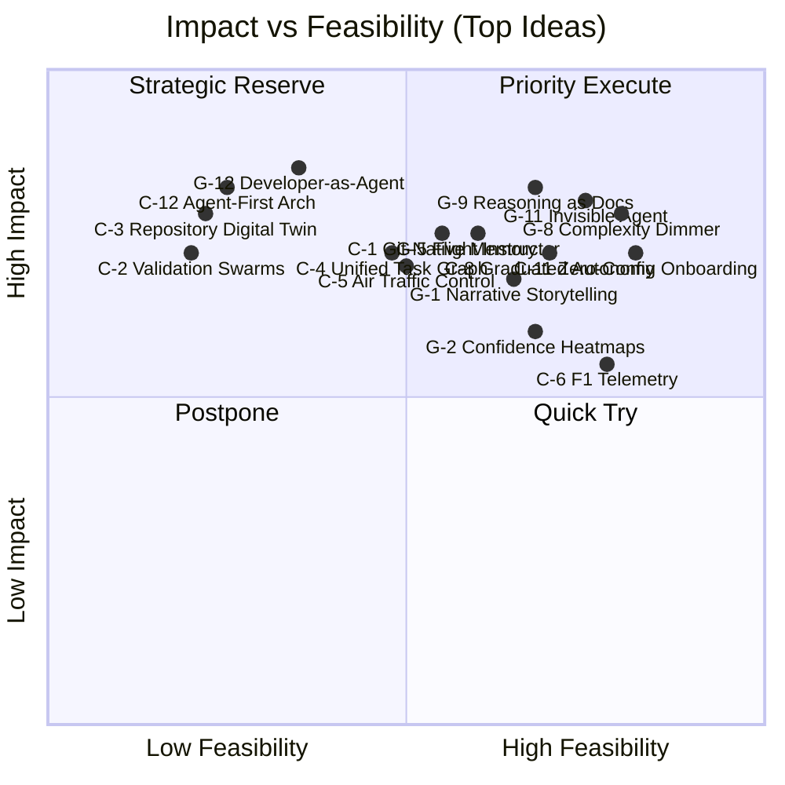
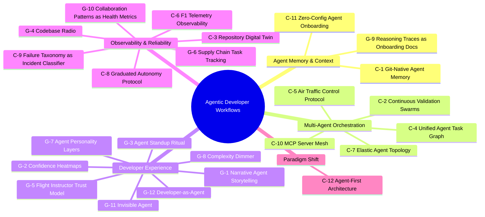

# Brainstorm Report: Agentic 开发者工作流

## Executive Summary

The agentic developer workflow space is at an inflection point: engineers use AI in roughly 60% of their work but fully delegate only 0-20% of tasks, revealing a massive gap between assistance and autonomy. Our research across 50 sources, 5 industry trends, and 5 real-world case studies produced 24 innovation ideas evaluated across impact, feasibility, innovation, and alignment. The top recommendation is **Zero-Config Agent Onboarding** — eliminating the cold-start configuration barrier that every developer faces — followed by a portfolio of developer-experience improvements that reduce cognitive load and build progressive trust. The strategic direction is clear: win on developer experience first, build observability second, pursue paradigm shifts third.

---

## 1. Research Landscape

### 1.1 Market Context

The agentic AI market is projected to reach **$52.62B by 2030** at a 46.3% CAGR. Gartner reports a **1,445% surge** in multi-agent system inquiries from Q1 2024 to Q2 2025. Yet beneath this explosive interest lies a sobering reality: fewer than **25% of organizations** have successfully scaled agent workflows to production. The gap is not capability — current agents can autonomously complete 85% of bounded refactoring tasks on codebases under 50K lines — but rather reliability, trust, and operational maturity.

The core tension defining 2026: engineers interact with AI constantly but hand over control rarely. This 60% usage vs. 0-20% delegation gap is the primary opportunity space. Closing it requires solving three interlocking problems: context management (agents forget everything between sessions), orchestration (multi-agent coordination is error-prone), and trust calibration (developers either over-restrict or over-trust agents).

### 1.2 Key Trends

1. **Multi-Agent Systems Surge**: GitHub Agent HQ enables Claude, Codex, and Copilot running simultaneously on the same task. Multi-perspective code generation is becoming the norm, not the exception.
2. **Repository Intelligence**: AI systems are moving beyond line-level understanding to grasping relationships and architectural intent across entire codebases — a capability shift identified in Anthropic's 2026 report.
3. **Parallel Agent Workflows**: Developers are transitioning from supervising a single synchronous assistant to managing multiple autonomous agents working in parallel.
4. **MCP as Standard Protocol**: Model Context Protocol has become the accepted interface for agent-tool interaction, driving demand for centralized management and discovery.
5. **Developer Role Transformation**: The value of software engineering is shifting from code-writing to system architecture, guardrail design, and output validation.

### 1.3 Competitive Landscape

The field is segmented across several layers:

- **Agent IDEs**: Cursor, Windsurf, and Claude Code compete on the developer surface, each taking different approaches to agent integration depth.
- **Orchestration Platforms**: GitHub Agent HQ, LangChain/LangGraph, and CrewAI target multi-agent coordination, though none has established a dominant standard.
- **Vertical Solutions**: Domain-specific tools (security review, performance optimization, test generation) are emerging as plug-in capabilities rather than standalone products.

Notable case studies include Claude Code achieving 85% autonomous refactoring completion, Thomas Ricouard reducing iOS app onboarding from weeks to days with Cursor Agent Mode, and AWS multi-agent workflows cutting issue resolution time by 86%. The pattern is consistent: agentic workflows excel at well-defined, bounded tasks but struggle with ambiguous architectural decisions.

---

## 2. Innovation Space

### 2.1 Ideation Process

Ideas were generated using the **SCAMPER** creative framework (Substitute, Combine, Adapt, Modify, Put to other use, Eliminate, Reverse) from two complementary perspectives:

- **Codex perspective** (12 ideas): Technical architecture and infrastructure focus — how to build the systems.
- **Gemini perspective** (12 ideas): Creative user experience focus — how developers interact with the systems.

This dual-lens approach ensured coverage of both engineering depth and human-centered design, preventing the common trap of technically elegant solutions that developers never adopt.

### 2.2 Ideas Overview

| Source                            | Count  | Focus                                    |
| --------------------------------- | ------ | ---------------------------------------- |
| Codex (Technical/Architecture)    | 12     | Infrastructure, protocols, system design |
| Gemini (Creative/User Experience) | 12     | UX, communication, trust, workflow feel  |
| **Total**                         | **24** |                                          |

All 7 SCAMPER angles were covered, with Substitute, Combine, Adapt, Modify, and Put-to-other-use each generating 4 ideas, while Eliminate and Reverse each produced 2.

### 2.3 Category Highlights

Ideas clustered into 5 affinity groups, each revealing a distinct insight:

1. **Agent Memory & Context** (3 ideas, highest avg score 3.85): The most tractable problem space. Solutions here have high impact precisely because the problem is universal and well-defined — every developer faces the cold-start problem.
2. **Multi-Agent Orchestration** (5 ideas, lowest avg score 3.04): The most technically ambitious category, dragged down by feasibility concerns. The insight: multi-agent is where the hype is, but single-agent experience is where the value is today.
3. **Developer Experience** (8 ideas, 3 in top 5): The largest cluster and the most represented in top rankings. The field's current differentiator is not agent capability but how developers interact with agents.
4. **Observability & Reliability** (7 ideas): The bridge between prototype and production. Without observability, the <25% production scaling rate will not improve.
5. **Paradigm Shift** (1 idea): Agent-first architecture is intellectually compelling but premature for execution. Best treated as a north star rather than a near-term project.

---

## 3. Evaluation Results

### 3.1 Methodology

Each idea was scored on four dimensions with balanced weights optimizing for practical deliverability alongside meaningful innovation:

| Dimension   | Weight | Focus                                                      |
| ----------- | ------ | ---------------------------------------------------------- |
| Impact      | 35%    | Problem-solving degree, beneficiary scope, value magnitude |
| Feasibility | 35%    | Technical difficulty, resource needs, time to deliver      |
| Innovation  | 20%    | Novelty, differentiation potential                         |
| Alignment   | 10%    | Fit with the goal of improving agentic developer workflows |

Composite formula: `Impact x 0.35 + Feasibility x 0.35 + Innovation x 0.20 + Alignment x 0.10`

### 3.2 Evaluation Matrix

The quadrant reveals a clear cluster of 5 ideas in the **Priority Execute** zone (high impact, high feasibility), a set of transformative ideas in **Strategic Reserve** (high impact, lower feasibility), and infrastructure-heavy ideas in **Postpone** that require the ecosystem to mature first.

### 3.3 Mindmap

---

## 4. Top 5 Proposals — Deep Analysis

### 4.1 #1: Zero-Config Agent Onboarding (C-11) — Score: 4.25

**Problem it solves**: Every developer using agentic tools faces the cold-start problem. Setting up CLAUDE.md, cursor rules, .clinerules, and other configuration files is tedious, error-prone, and creates an adoption barrier. Research identifies context management as the critical enabler for agentic workflows, yet the burden falls entirely on the human.

**How it works**: On first invocation in a new repository, the agent runs a comprehensive bootstrap analysis. It reads the README for project intent, inspects CI configuration for quality gates, analyzes git history for conventions (commit message style, branching strategy, PR template patterns), infers coding standards from existing code patterns (indentation, naming, module structure), and maps the dependency graph. This analysis produces a structured agent configuration file that captures the project's implicit rules. The generated configuration is presented to the developer for review — a 2-minute validation pass instead of a 2-hour authoring session — then committed as the canonical agent configuration.

The system treats git history as a first-class signal. Commit frequency patterns reveal which modules are actively evolving. Revert patterns expose fragile areas requiring conservative agent behavior. PR review comment themes surface quality expectations that no static configuration captures.

**Implementation path**:

- Phase 1 (4 weeks): Convention inference engine — git history analysis, CI config parsing, coding standard detection. Output: a generated `.agent-config.yml` with inferred rules.
- Phase 2 (3 weeks): Interactive review UI — developer sees inferred conventions, confirms/corrects/overrides. Corrections feed back into the inference model.
- Phase 3 (2 weeks): Continuous learning — as the developer corrects agent behavior post-setup, those corrections auto-update the configuration. The config evolves with the project.

**Risks and mitigations**: Inferred conventions may be incorrect for projects with inconsistent styles. Mitigation: always present inference as a proposal, never auto-commit. Include confidence scores per inference so developers know which rules to scrutinize. For inconsistent projects, present multiple detected patterns and let the developer choose.

**Success metrics**: Time from first agent invocation to productive use (target: <5 minutes). Configuration accuracy rate measured by developer override frequency (target: <15% override rate after Phase 2). Adoption rate among new projects (target: 80% of new repos use auto-generated config within 3 months).

### 4.2 #2: Invisible Agent for Routine Work (G-11) — Score: 3.90

**Problem it solves**: Developers experience decision fatigue from dozens of trivial approvals per day — formatting fixes, dependency version bumps, boilerplate generation, and other routine tasks that interrupt flow. Each interruption costs 10-15 minutes of context recovery. The current agent interaction model treats every task equally, whether it is a critical architectural change or a one-line import fix.

**How it works**: A task complexity classifier evaluates each agent operation against a risk-impact matrix. Operations below a configurable threshold execute silently — the agent acts like an autoformatter or linter that runs on save. Changes appear in a quiet "agent changelog" sidebar that the developer reviews at their leisure, not as blocking approval prompts. The UX principle: agents should be as invisible as garbage collection. You only notice them when something goes wrong.

The classification system starts conservative (formatting, import sorting, trivial lint fixes) and expands its scope as it demonstrates reliability. Each category of silent operation has its own revert mechanism. If a silent change causes a test failure, the system auto-reverts and escalates the task to interactive mode.

**Implementation path**:

- Phase 1 (3 weeks): Define the initial "routine" task taxonomy. Implement silent execution for formatting, import organization, and lint auto-fixes. Build the changelog sidebar UI.
- Phase 2 (4 weeks): Add dependency update support with automated testing gate. Expand to boilerplate generation for known patterns (test stubs, API endpoints matching project conventions).
- Phase 3 (ongoing): Machine-learned classification — track which tasks developers always approve without review and gradually move them into the silent category.

**Risks and mitigations**: A misclassified non-routine task executing silently could introduce subtle bugs. Mitigation: conservative initial thresholds, mandatory test pass before silent commit, quiet changelog with clear revert buttons, and a weekly "silent activity digest" showing everything the agent did without asking.

**Success metrics**: Reduction in daily approval prompts (target: 60% fewer interruptions). Developer flow time per session (target: 30% increase in uninterrupted coding blocks). Zero silent-change-induced production incidents over first 6 months.

### 4.3 #3: Agent Reasoning Traces as Onboarding Documentation (G-9) — Score: 3.85

**Problem it solves**: Documentation goes stale the moment it is written. New team members spend weeks navigating codebases where the "why" behind architectural decisions exists only in the heads of senior engineers. Agent reasoning traces — the chains of logic agents produce when modifying code — capture exactly this "why" as a free byproduct of development, but today they are discarded after each session.

**How it works**: Every time an agent modifies code, its reasoning trace is captured, structured, and linked to the corresponding commit. When an agent refactors a service, its reasoning ("This service was split because the original violated single-responsibility principle; the payment logic depends on external gateway timeouts that should not block order processing") becomes a navigable architectural tour. New developers do not read stale wiki pages — they walk through the agent's reasoning chains to understand why the codebase is shaped the way it is.

The system curates traces through a quality filter: confidence scoring determines which traces are documentation-worthy, and a summarization layer condenses verbose reasoning into concise architectural notes. Traces are organized by module, linked bidirectionally to code (click a function to see why it exists; click a reasoning trace to see what code it produced), and versioned alongside the code itself.

**Implementation path**:

- Phase 1 (5 weeks): Structured trace capture — hook into agent output pipelines to extract reasoning steps. Commit-linkage system. Storage layer (git-native or sidecar database).
- Phase 2 (4 weeks): Quality filter and summarization. Navigation UI — "architectural tour" mode that walks through traces by module, by timeline, or by concept.
- Phase 3 (3 weeks): Search and discovery. Integration with IDE hover/go-to-definition. "Why does this code exist?" query support.

**Risks and mitigations**: Raw reasoning traces are verbose and inconsistent in quality. Mitigation: confidence scoring filters out low-quality traces. Human curation pass for the initial corpus. Over time, the quality filter learns from which traces developers actually read.

**Success metrics**: New developer onboarding time (target: 40% reduction). Documentation currency — percentage of modules with reasoning traces less than 30 days old (target: 80%). Developer satisfaction score for onboarding experience.

### 4.4 #4: Complexity Dimmer Control (G-8) — Score: 3.80

**Problem it solves**: Agent output verbosity is a constant source of friction. Too verbose and developers skip reading it. Too terse and developers do not trust it. Different contexts genuinely need different levels of detail — reviewing a critical infrastructure change demands full reasoning chains, while a routine dependency update needs just a summary.

**How it works**: A continuous slider (1-10) controls how much detail the agent exposes for any interaction. At position 1: a one-line summary and a "Ship it" button. At position 5: summary, key decisions, files changed, test results. At position 10: full reasoning chain, alternative approaches considered, confidence levels per decision, and performance benchmarks. The metaphor of a physical dimmer makes the abstract concept of AI transparency tangible.

The system learns from developer behavior — tracking which dimmer level is used for which task patterns and auto-suggesting appropriate levels. Infrastructure changes default to 7; formatting fixes default to 2. Developers override when they want, and the system adapts.

**Implementation path**:

- Phase 1 (3 weeks): Define 10 verbosity tiers with clear content boundaries. Implement the slider UI. Apply to agent status messages and PR descriptions.
- Phase 2 (2 weeks): Auto-suggestion engine — classify task type, suggest dimmer level, learn from overrides.
- Phase 3 (2 weeks): Extend to code comments, commit messages, and inline explanations. Per-project default profiles.

**Risks and mitigations**: Finding the right default per task type. Mitigation: start with conservative defaults (higher verbosity), learn from developer adjustments, converge through usage data.

**Success metrics**: Developer-reported satisfaction with agent communication (target: 4.5/5). Reduction in "explain more" / "too much detail" feedback cycles (target: 70% fewer).

### 4.5 #5: Graduated Autonomy Protocol (C-8) — Score: 3.80

**Problem it solves**: The current trust model for agents is binary — an agent either can or cannot perform an action. This forces developers into a lose-lose choice: over-restrict agents (losing productivity) or over-trust them (risking code quality). Neither calibration is correct, and the right level varies by agent track record, code region, and task type.

**How it works**: Inspired by autonomous vehicle safety levels (L1-L5), agents start at L1 (suggest-only) on a new project. As they demonstrate reliability — measured by suggestion acceptance rate, test pass rate of generated code, and absence of reverted changes — they graduate to higher levels: L2 (auto-apply with review), L3 (auto-apply non-critical paths), L4 (auto-merge with passing tests), L5 (full autonomous with rollback capability). Trust levels are granular: per-agent, per-repository, and per-code-region. An agent might be L4 in the test suite but L2 in the payment processing module.

Delayed quality signals (reverts within 7 days, bugs traced to agent-generated code) feed back into the trust score, preventing gaming where an agent optimizes for immediate acceptance rate at the expense of long-term quality.

**Implementation path**:

- Phase 1 (4 weeks): Reliability metrics collector — track acceptance rate, test pass rate, revert frequency per agent per code region. Trust scoring algorithm with configurable thresholds.
- Phase 2 (3 weeks): Permission enforcement layer — intercept agent actions and enforce level-appropriate gates. UI showing current trust level per region.
- Phase 3 (4 weeks): Delayed signal integration — 7-day bug correlation, production incident attribution. Per-team trust profiles.

**Risks and mitigations**: Metric gaming. Mitigation: include delayed quality signals that are hard to game. Cold-start problem for new code regions. Mitigation: inherit trust level from the nearest parent module, with a configurable dampening factor.

**Success metrics**: Agent-generated code defect rate (target: parity with human-written code within 6 months). Developer trust score surveys (target: steady increase quarter over quarter). Percentage of code regions at L3+ (target: 50% within 12 months).

---

## 5. Strategic Recommendations

### 5.1 Short-term Wins (0-3 months)

1. **Ship Zero-Config Agent Onboarding** (C-11): The highest-scoring idea with the shortest path to value. Components exist in isolation — integrate them. This removes the single biggest adoption barrier.
2. **Build the Complexity Dimmer** (G-8): Primarily a UX change, minimal backend work. Immediately improves every agent interaction. Ship as a feature flag and iterate based on usage data.
3. **Prototype F1 Telemetry Dashboard** (C-6): Quick win from the evaluation's "Quick Try" quadrant. A lightweight agent observability dashboard builds internal operational knowledge needed for later investments.

### 5.2 Medium-term Investments (3-12 months)

1. **Deploy Invisible Agent** (G-11): Requires the complexity classifier from Phase 1 learnings. Start with formatting and lint, expand category by category. Measure interruption reduction rigorously.
2. **Implement Graduated Autonomy** (C-8): Depends on observability data from the F1 Telemetry prototype. Needs 3+ months of reliability data before trust scoring is meaningful.
3. **Launch Reasoning Traces as Docs** (G-9): Requires trace capture infrastructure and quality filtering. Best started after agents are actively used in production (dependent on items above).

### 5.3 Long-term Bets (12+ months)

1. **Git-Native Agent Memory** (C-1): Once zero-config onboarding proves the value of automated context, evolve toward persistent, version-controlled memory that accumulates across sessions.
2. **Unified Agent Task Graph** (C-4): As multi-agent usage matures, the need for a single orchestration DAG spanning human and agent work will become acute.
3. **Agent-First Architecture** (C-12): The north star. Every short and medium-term investment should be evaluated against the question: "Does this move us toward a world where agents are the primary actors?"

---

## 6. Risks & Blind Spots

**What was not covered**:

- **Pricing and unit economics**: Agent compute costs per task, per-seat vs. per-token pricing models, and ROI frameworks for enterprise buyers were not explored. Any production deployment needs a cost model.
- **Security and compliance**: Regulated industries (finance, healthcare) require audit trails for agent-generated code. Compliance frameworks for autonomous code generation are nascent.
- **Team dynamics**: How agentic workflows affect junior developer skill development. If agents handle routine coding, how do juniors learn? This pedagogical gap could create long-term talent pipeline issues.

**What could go wrong**:

- **Trust erosion events**: A single high-profile incident where an autonomous agent introduces a security vulnerability could set adoption back by years. The graduated autonomy protocol (C-8) is partially a hedge against this risk, but industry-wide trust is fragile.
- **Model capability plateaus**: All proposals assume continued improvement in LLM reasoning capability. If progress stalls, the delegation gap may persist regardless of tooling improvements.
- **Developer resistance**: Some engineers may resist the shift from code-writer to orchestrator for identity reasons, not just practical ones. UX design must respect this emotional dimension.

---

## 7. Action Plan

| Week  | Action                                                                                            | Owner         | Deliverable                                |
| ----- | ------------------------------------------------------------------------------------------------- | ------------- | ------------------------------------------ |
| 1-2   | Validate Zero-Config feasibility — prototype git history convention inference on 3 internal repos | Tech Lead     | Feasibility report + accuracy measurements |
| 3-4   | Design Complexity Dimmer UX — user research with 5 developers on verbosity preferences            | UX Lead       | Wireframes + verbosity tier definitions    |
| 5-8   | Build Zero-Config MVP — convention inference + interactive review UI                              | Backend Team  | Deployed feature behind flag               |
| 6-8   | Ship Complexity Dimmer v1 — 10-tier slider for agent status messages                              | Frontend Team | Deployed feature behind flag               |
| 9-10  | Internal dogfood — team uses both features for 2 weeks; collect data                              | All           | Usage metrics + feedback log               |
| 11-12 | Iterate and launch — address feedback, remove feature flags, publish                              | Product + Eng | GA release of both features                |
| 13+   | Begin Invisible Agent classifier design based on dimmer usage data                                | Tech Lead     | Task taxonomy + architecture doc           |

---

## Appendix

### A. Phase Artifacts

| Phase         | Artifact            | Description                                                                    |
| ------------- | ------------------- | ------------------------------------------------------------------------------ |
| 1. Research   | `research-brief.md` | Topic analysis, 5 industry trends, 5 case studies, 6 problems, 5 opportunities |
| 2. Ideation   | `ideas-pool.md`     | 24 ideas (12 Codex + 12 Gemini) across 7 SCAMPER angles                        |
| 3. Evaluation | `evaluation.md`     | Balanced scoring, quadrant chart, mindmap, top-5 detailed analysis             |

### B. Process Metadata

| Metric                | Value                                                                               |
| --------------------- | ----------------------------------------------------------------------------------- |
| Research searches     | 5 (trend, case, cross-industry, problems, opportunities)                            |
| Sources analyzed      | 50 unique URLs                                                                      |
| Ideas generated       | 24 (12 technical + 12 creative)                                                     |
| Evaluation dimensions | 4 (Impact 35%, Feasibility 35%, Innovation 20%, Alignment 10%)                      |
| Affinity groups       | 5                                                                                   |
| Score range           | 2.20 (C-10) to 4.25 (C-11)                                                          |
| Generation timestamp  | 2026-02-26T10:42:38+08:00 (research) through 2026-02-26T11:05:00+08:00 (evaluation) |
