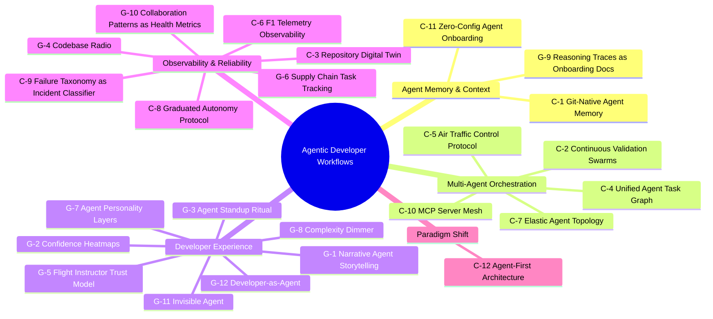
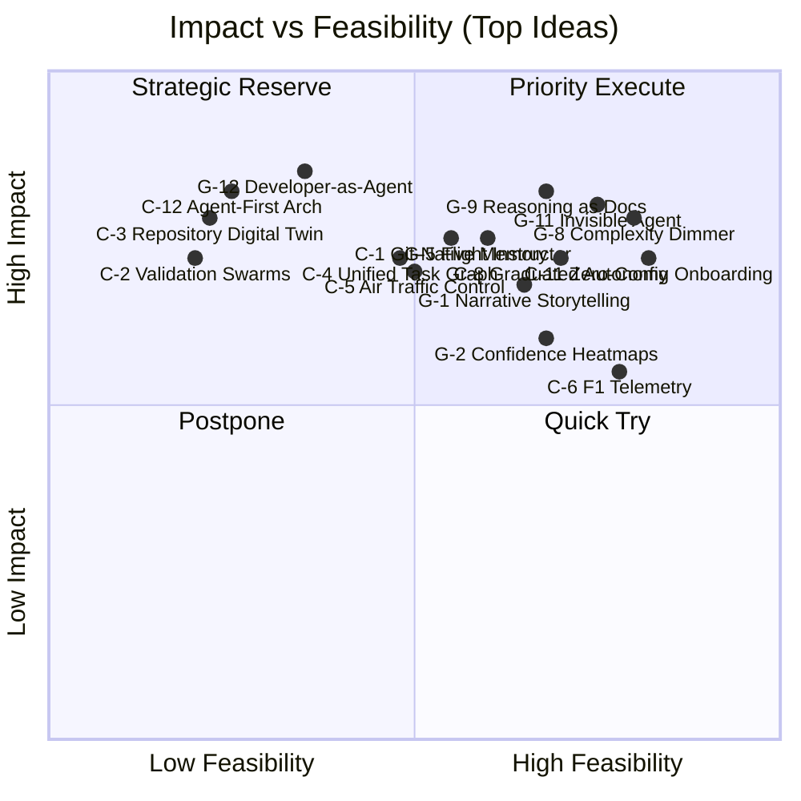

# Idea Evaluation Report

## 1. Overview

**Evaluation Mode**: Balanced — optimizes for a mix of real-world impact and practical deliverability, with meaningful weight on innovation.

**Weights**:

| Dimension   | Weight | Evaluation Focus                                        |
| ----------- | ------ | ------------------------------------------------------- |
| Impact      | 35%    | Problem solving degree, beneficiary scope, value size   |
| Feasibility | 35%    | Technical difficulty, resource needs, time cost         |
| Innovation  | 20%    | Novelty, differentiation, market reaction               |
| Alignment   | 10%    | Goal fit (improving agentic dev workflows), constraints |

**Composite formula**: `Impact×0.35 + Feasibility×0.35 + Innovation×0.20 + Alignment×0.10`

**Affinity Groups** (5):

1. Agent Memory & Context
2. Multi-Agent Orchestration
3. Developer Experience
4. Observability & Reliability
5. Paradigm Shift

---

## 2. Mindmap

---

## 3. Evaluation Matrix

### Matrix Interpretation

- **Priority Execute** (high impact + high feasibility): C-11 Zero-Config Onboarding, G-8 Complexity Dimmer, G-11 Invisible Agent, G-9 Reasoning as Docs, C-8 Graduated Autonomy — these ideas solve real pain points with achievable engineering effort and should be pursued first.
- **Strategic Reserve** (high impact + low feasibility): C-1 Git-Native Memory, G-12 Developer-as-Agent, C-12 Agent-First Architecture — transformative potential but require significant infrastructure investment; best started as research prototypes.
- **Quick Try** (low impact + high feasibility): C-6 F1 Telemetry, G-3 Agent Standup — relatively easy to build and provide incremental value; good for team morale and quick wins.
- **Postpone** (low impact + low feasibility): C-2 Validation Swarms, C-3 Repository Digital Twin, C-10 MCP Server Mesh — high technical complexity without proportionally higher payoff in the near term.

---

## 4. Top 5 Ranking

| Rank | ID   | Title                        | Impact | Feasibility | Innovation | Alignment | Composite |
| ---- | ---- | ---------------------------- | ------ | ----------- | ---------- | --------- | --------- |
| 1    | C-11 | Zero-Config Agent Onboarding | 4      | 5           | 3          | 5         | 4.25      |
| 2    | G-11 | Invisible Agent              | 4      | 4           | 3          | 5         | 3.90      |
| 3    | G-9  | Reasoning Traces as Docs     | 4      | 3           | 5          | 4         | 3.85      |
| 4    | G-8  | Complexity Dimmer            | 4      | 4           | 3          | 4         | 3.80      |
| 5    | C-8  | Graduated Autonomy Protocol  | 4      | 4           | 3          | 4         | 3.80      |

> Note: G-8 and C-8 are tied at 3.80. G-8 ranks higher due to broader applicability (every agent interaction vs. permission management). Both are strong "Priority Execute" candidates.

---

## 5. Top 5 Details

### Rank 1: C-11 — Zero-Config Agent Onboarding (4.25)

**One-liner**: Eliminate manual CLAUDE.md / rules files by auto-inferring project conventions from existing code and git history.

| Dimension   | Score | Rationale                                                                                                                                                                                                                       |
| ----------- | ----- | ------------------------------------------------------------------------------------------------------------------------------------------------------------------------------------------------------------------------------- |
| Impact      | 4     | Solves a universal friction point. Every developer using agentic tools faces the cold-start problem of writing configuration. Reduces onboarding time from hours to minutes. Broad beneficiary base — applies to every project. |
| Feasibility | 5     | Components already exist in isolation: git log parsers, CI config readers, coding convention extractors. No novel research required. Short timeline. Low resource needs.                                                        |
| Innovation  | 3     | The concept of "convention over configuration" is well-established (Rails popularized it). Applying it to agent setup is a logical extension, not a breakthrough. But execution would differentiate.                            |
| Alignment   | 5     | Directly addresses the "context management is the critical enabler" finding from the research brief. Removes the single biggest barrier to agent adoption.                                                                      |

**Risk**: Inferred conventions may be wrong for projects with inconsistent coding styles. Mitigation: always present inference results for human review before committing.

---

### Rank 2: G-11 — Invisible Agent for Routine Work (3.90)

**One-liner**: Remove the agent interaction surface for low-risk routine tasks; agents operate silently like autoformatters.

| Dimension   | Score | Rationale                                                                                                                                                                                                                                      |
| ----------- | ----- | ---------------------------------------------------------------------------------------------------------------------------------------------------------------------------------------------------------------------------------------------- |
| Impact      | 4     | Eliminates decision fatigue from dozens of trivial approvals per day. Research shows developers context-switch ~50 times/day; reducing agent-related switches is high value. Scope limited to routine tasks keeps risk low.                    |
| Feasibility | 4     | Requires a well-defined task complexity classifier and a reliable rollback mechanism. Classifying "routine" vs "non-routine" is non-trivial but bounded. Can ship incrementally — start with formatting/linting, expand to dependency updates. |
| Innovation  | 3     | Conceptually similar to how IDEs already handle autoformatting on save. The innovation is extending this to agent-level operations, which is an incremental step.                                                                              |
| Alignment   | 5     | Directly addresses "developer role transformation" — reducing cognitive load on routine work frees developers for high-value orchestration.                                                                                                    |

**Risk**: Misclassification of a non-routine task as routine could introduce subtle bugs. Mitigation: conservative initial thresholds + quiet changelog for post-hoc review.

---

### Rank 3: G-9 — Agent Reasoning Traces as Onboarding Documentation (3.85)

**One-liner**: Repurpose agent reasoning chains as living, commit-linked architectural documentation for onboarding.

| Dimension   | Score | Rationale                                                                                                                                                                                                                             |
| ----------- | ----- | ------------------------------------------------------------------------------------------------------------------------------------------------------------------------------------------------------------------------------------- |
| Impact      | 4     | Addresses a persistent industry problem — documentation going stale. Onboarding is costly (weeks to months for complex codebases). Agent-generated reasoning is already produced; capturing it adds value at near-zero marginal cost. |
| Feasibility | 3     | Requires: (a) structured storage of reasoning traces, (b) linking to commits, (c) a navigable UI. The challenge is curation — raw reasoning traces are verbose and not all are useful. Needs a quality filter.                        |
| Innovation  | 5     | Genuinely novel reframing. No existing tool captures "why the code is this way" as a byproduct of agent work. This is a breakthrough-level insight — documentation that writes itself as a side effect of development.                |
| Alignment   | 4     | Indirectly improves workflows by making codebases more navigable for both humans and future agent sessions. Addresses session memory loss.                                                                                            |

**Risk**: Reasoning trace quality varies; low-quality traces become noise rather than documentation. Mitigation: confidence scoring + human curation pass.

---

### Rank 4: G-8 — Complexity Dimmer Control (3.80)

**One-liner**: A continuous slider (1-10) controlling how much reasoning detail the agent exposes — from "Ship it" to full reasoning chain.

| Dimension   | Score | Rationale                                                                                                                                                                |
| ----------- | ----- | ------------------------------------------------------------------------------------------------------------------------------------------------------------------------ |
| Impact      | 4     | Addresses the tension between agent transparency and developer efficiency. Different tasks genuinely need different verbosity. Applicable to every agent interaction.    |
| Feasibility | 4     | Primarily a UX and presentation-layer change. Agent reasoning traces already exist; this filters what's shown. The "dimmer" metaphor is intuitive. Minimal backend work. |
| Innovation  | 3     | Verbosity controls exist in many tools (log levels). The dimmer metaphor and continuous scale add polish but not fundamental novelty.                                    |
| Alignment   | 4     | Supports the workflow goal by letting developers tune agent interaction to context, but it's an enhancement, not a structural improvement.                               |

**Risk**: Finding the right default position per task type. Mitigation: learn from developer behavior — track which dimmer level is used for which task patterns and auto-suggest.

---

### Rank 5: C-8 — Graduated Autonomy Protocol (3.80)

**One-liner**: Replace binary agent permissions with L1-L5 trust levels earned through demonstrated reliability.

| Dimension   | Score | Rationale                                                                                                                                                                                                                        |
| ----------- | ----- | -------------------------------------------------------------------------------------------------------------------------------------------------------------------------------------------------------------------------------- |
| Impact      | 4     | Solves the trust calibration problem — developers either over-restrict agents (losing productivity) or over-trust them (risking quality). Graduated levels let the system self-calibrate. Per-region granularity is powerful.    |
| Feasibility | 4     | Reliability metrics (acceptance rate, test pass rate, revert rate) are straightforward to collect. Trust scoring is a well-understood pattern from security systems. Per-region permissions add complexity but can be phased in. |
| Innovation  | 3     | The L1-L5 framing is borrowed from autonomous vehicles, which is a good analogy but not novel. Incremental over existing permission systems.                                                                                     |
| Alignment   | 4     | Directly addresses the research brief's finding that "agents require human oversight" — graduated autonomy makes oversight proportional to demonstrated capability.                                                              |

**Risk**: Gaming — an agent might optimize for metrics (high acceptance rate) rather than quality. Mitigation: include delayed quality signals (e.g., reverts within 7 days) in the trust score.

---

## 6. Group Statistics

| Group                       | Ideas | Avg Score | Top Idea                      | Top Score |
| --------------------------- | ----- | --------- | ----------------------------- | --------- |
| Agent Memory & Context      | 3     | 3.85      | C-11 Zero-Config Onboarding   | 4.25      |
| Multi-Agent Orchestration   | 5     | 3.04      | C-4 Unified Task Graph        | 3.45      |
| Developer Experience        | 8     | 3.50      | G-11 Invisible Agent          | 3.90      |
| Observability & Reliability | 7     | 3.29      | C-8 Graduated Autonomy        | 3.80      |
| Paradigm Shift              | 1     | 3.15      | C-12 Agent-First Architecture | 3.15      |

**Observations**:

- **Agent Memory & Context** has the highest average despite only 3 ideas — the problem space is well-defined and solutions are tractable.
- **Developer Experience** dominates in volume (8 ideas) and contains the most top-5 entries (3), reflecting the field's current focus on UX as a differentiator.
- **Multi-Agent Orchestration** scores lowest on average — technically ambitious ideas dragged down by feasibility concerns.
- **Paradigm Shift** has a single idea (C-12) that scores moderately; paradigm shifts are inherently high-risk.

---

## 7. Full Evaluation Table

Click to expand all 24 idea evaluations

| Rank | ID   | Title                                    | Group                       | Impact | Feasibility | Innovation | Alignment | Composite |
| ---- | ---- | ---------------------------------------- | --------------------------- | ------ | ----------- | ---------- | --------- | --------- |
| 1    | C-11 | Zero-Config Agent Onboarding             | Agent Memory & Context      | 4      | 5           | 3          | 5         | 4.25      |
| 2    | G-11 | Invisible Agent for Routine Work         | Developer Experience        | 4      | 4           | 3          | 5         | 3.90      |
| 3    | G-9  | Reasoning Traces as Onboarding Docs      | Agent Memory & Context      | 4      | 3           | 5          | 4         | 3.85      |
| 4    | G-8  | Complexity Dimmer Control                | Developer Experience        | 4      | 4           | 3          | 4         | 3.80      |
| 5    | C-8  | Graduated Autonomy Protocol (L1-L5)      | Observability & Reliability | 4      | 4           | 3          | 4         | 3.80      |
| 6    | G-1  | Narrative Agent Storytelling             | Developer Experience        | 3      | 4           | 4          | 4         | 3.65      |
| 7    | G-5  | Flight Instructor Trust Model            | Developer Experience        | 4      | 3           | 4          | 4         | 3.65      |
| 8    | G-12 | Developer-as-Agent Intent Model          | Developer Experience        | 4      | 2           | 5          | 4         | 3.50      |
| 9    | C-6  | F1 Telemetry Observability               | Observability & Reliability | 3      | 4           | 3          | 4         | 3.45      |
| 10   | C-1  | Git-Native Agent Memory                  | Agent Memory & Context      | 4      | 3           | 3          | 4         | 3.45      |
| 11   | G-2  | Agent Confidence Heatmaps                | Developer Experience        | 3      | 4           | 3          | 4         | 3.45      |
| 12   | C-4  | Unified Agent Task Graph                 | Multi-Agent Orchestration   | 4      | 3           | 3          | 4         | 3.45      |
| 13   | C-9  | Failure Taxonomy as Incident Classifier  | Observability & Reliability | 3      | 4           | 3          | 3         | 3.30      |
| 14   | C-5  | Air Traffic Control Protocol             | Multi-Agent Orchestration   | 4      | 3           | 3          | 3         | 3.30      |
| 15   | G-3  | Agent Standup Ritual                     | Developer Experience        | 3      | 4           | 2          | 4         | 3.25      |
| 16   | G-6  | Supply Chain Task Tracking               | Observability & Reliability | 3      | 4           | 2          | 4         | 3.25      |
| 17   | G-10 | Collaboration Patterns as Health Metrics | Observability & Reliability | 3      | 3           | 4          | 3         | 3.20      |
| 18   | C-12 | Agent-First Architecture                 | Paradigm Shift              | 4      | 2           | 4          | 3         | 3.15      |
| 19   | C-3  | Repository Digital Twin                  | Observability & Reliability | 4      | 1           | 4          | 4         | 3.15      |
| 20   | C-2  | Continuous Validation Swarms             | Multi-Agent Orchestration   | 4      | 1           | 4          | 4         | 3.15      |
| 21   | C-7  | Elastic Agent Topology                   | Multi-Agent Orchestration   | 3      | 3           | 3          | 4         | 3.10      |
| 22   | G-4  | Codebase Radio (Ambient Sonification)    | Observability & Reliability | 2      | 3           | 4          | 3         | 2.85      |
| 23   | G-7  | Agent Personality Layers                 | Developer Experience        | 2      | 4           | 2          | 3         | 2.80      |
| 24   | C-10 | MCP Server Mesh as Service Protocol      | Multi-Agent Orchestration   | 3      | 1           | 3          | 2         | 2.20      |

